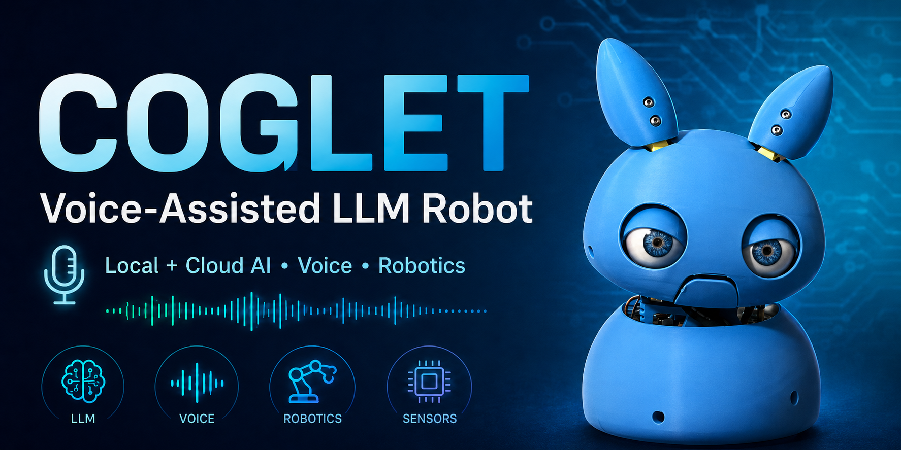
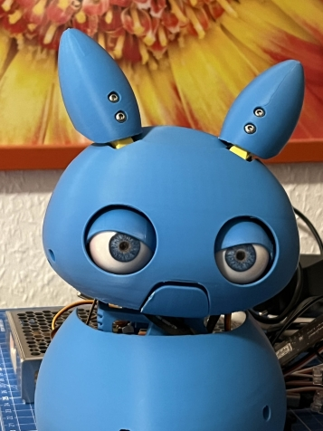
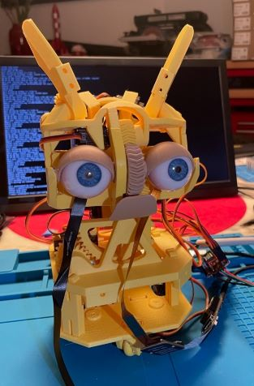
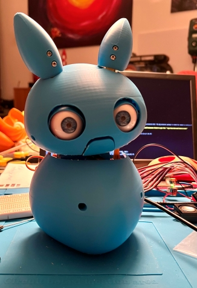
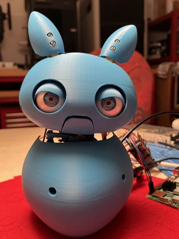

  

# Robot Coglet con LLM Asistido por Voz

Un prototipo de robot/animatrónica con entrada/salida de voz, ojos y movimiento de cabeza animados, seguimiento facial y dos modos de conversación claramente separados:

| Modo | Iniciador | Pipeline de conversación |
|---|---|---|
| **Modo Local** | `pi-side/coglet-local.py` | VAD de hardware o palabra de activación opcional -> grabación local -> Faster-Whisper -> Ollama -> Piper/MQTT TTS => Priorizando la protección y privacidad de los datos |
| **Modo en la Nube** | `pi-side/coglet-cloud.py` | Sesión continua de voz a voz con OpenAI Realtime sin palabra de activación => Los datos se envían a OpenAI, sin privacidad ni protección |

Los iniciadores están intencionalmente separados. `coglet-local.py` es exclusivo para uso local; no contiene ninguna ruta de ejecución de OpenAI Realtime. Para utilizar OpenAI Realtime, inicie `coglet-cloud.py` en su lugar.

Ambos iniciadores utilizan el mismo archivo privado `pi-side/env-exports.sh`. El ejecutable seleccionado determina el modo; no hay un selector de backend en tiempo de ejecución.

## Modo Local

El Modo Local ha sido diseñado teniendo en cuenta la privacidad y la protección de los datos: mantiene la conversación completamente local, no se envía nada a través de internet. 
El LLM se aloja localmente, y la lógica de control, así como la conversión de voz a texto y texto a voz, se ejecutan localmente.
Por defecto, Coglet puede activarse mediante el VAD de hardware XVF3800; OpenWakeWord sigue estando disponible como activador de palabra de activación opcional.

```text
-> activador de voz VAD de hardware o detección opcional de OpenWakeWord
-> entrada hablada
-> STT Faster-Whisper en el servidor GPU
-> LLM Ollama
-> TTS Piper/MQTT en el Raspberry Pi
-> respuesta hablada
-> ventana de conversación de seguimiento
```

La animación del robot, el manejo de audio de ReSpeaker, el VAD/DoA de hardware, el seguimiento facial, los servomotores, el LED de estado, el sueño profundo, la detección de comandos locales y la ruta local de correo electrónico permanecen en el Raspberry Pi.

Inicie el Modo Local con:

```bash
cd /opt/coglet-pi
source .venv/bin/activate
source env-exports.sh
python3 coglet-local.py
```

El Modo Local no requiere una clave API de OpenAI.

## Modo en la Nube con OpenAI Realtime

El Modo en la Nube se inicia explícitamente con `coglet-cloud.py`. Abre una sesión continua de OpenAI Realtime de inmediato; no hay palabra de activación ni pipeline local de STT/LLM/TTS para la conversación en sí.
En el modo en la nube, el LLM, el VAD, la conversión de voz a texto y texto a voz son manejados por OpenAI, por lo que sus datos y voz se envían a OpenAI y no se garantiza la privacidad ni la protección de datos en el Modo en la Nube.

El Raspberry Pi sigue manejando:

- audio de micrófono y altavoz,
- integración de hardware ReSpeaker,
- animaciones del robot y LED de estado,
- seguimiento facial y control de servomotores,
- apagado ordenado y estacionamiento de servomotores,
- entrega de correo electrónico SMTP local.

OpenAI Realtime maneja:

- VAD y detección de turnos de conversación del lado del servidor,
- reconocimiento y razonamiento del habla,
- generación de voz con una voz de OpenAI,
- llamadas a funciones para herramientas compatibles con Coglet.

Las características actuales del Modo en la Nube incluyen:

- conversación continua de voz a voz utilizando `gpt-realtime-2` por defecto,
- voz de OpenAI y mensaje del sistema configurables,
- interrupción (barge-in) y cancelación de respuesta,
- apagado verbal ordenado antes de que los servomotores se muevan a su posición de estacionamiento,
- herramienta de función `send_email`: el modelo crea el asunto y el contenido HTML estructurado; el Pi envía el correo electrónico a través de la configuración SMTP local existente,
- resumen de uso de la sesión al apagarse con el número de respuestas, tokens de entrada/salida, tokens en caché y duración de la sesión.

Inicie el Modo en la Nube con el mismo archivo de entorno:

```bash
cd /opt/coglet-pi
source .venv/bin/activate
source env-exports.sh
python3 coglet-cloud.py
```

### Configuración en la Nube

Valores de ejemplo en `pi-side/env-exports.sh.example`:

```bash
export OPENAI_API_KEY=""  # set only in the private env-exports.sh
export OPENAI_REALTIME_MODEL="gpt-realtime-2"
export OPENAI_REALTIME_VOICE="marin"
export OPENAI_REALTIME_REASONING_EFFORT="low"
export OPENAI_REALTIME_VAD_MODE="server_vad"
export OPENAI_REALTIME_TRANSCRIPTION="true"
export OPENAI_REALTIME_TRANSCRIPTION_MODEL="gpt-4o-mini-transcribe"
export OPENAI_REALTIME_STARTUP_MESSAGE="Ich bin online und bereit zu helfen."
export OPENAI_REALTIME_SHUTDOWN_MESSAGE="Tschüss!"
```

`coglet-cloud.py` siempre inicia OpenAI Realtime y falla claramente cuando falta su configuración o dependencia requerida. Nunca vuelve al Modo Local. `coglet-local.py` siempre inicia el Modo Local.

El mensaje de sistema/persona de Realtime se carga por separado de la persona local de Ollama. No comprometan (suban) claves API reales. El Modo en la Nube envía el audio de la conversación a OpenAI y genera costos de uso de la API.

Para ver la plantilla completa del entorno compartido, consulte `pi-side/env-exports.sh.example`. Las notas de validación de hardware están en `pi-side/MANUAL-HARDWARE-TESTS.md`.

## Licencia y Créditos

Este proyecto está licenciado bajo la [Licencia Creative Commons Atribución-NoComercial-CompartirIgual 4.0 Internacional](https://creativecommons.org/licenses/by-nc-sa/4.0/).

Partes de la lógica de control de servomotores y seguimiento facial están adaptadas del trabajo de [Will Cogley](https://www.willcogley.com/), utilizadas bajo la misma licencia (CC BY-NC-SA 4.0). Hemos modificado y extendido el código original para el proyecto Coglet.

## Hardware utilizado

- 1x Raspberry Pi 5 de 8 GB con fuente de alimentación USB-C
- 1x Seeedstudio Grove AI Vision V2 con cámara
- 1x Array USB de 4 micrófonos basado en Seeedstudio ReSpeaker XMOS XVF3800 con AEC, AGC, DoA, VAD, dereverberación, formación de haces y supresión de ruido en hardware
- 1x Altavoz pasivo de 4 ohmios y 3-5 W conectado al terminal de altavoz de ReSpeaker
- 10x Microservomotores MG90S
- 1x Tarjeta controladora de servomotores PCA9685
- 1x Fuente de alimentación Mean Well RSP-100-5, 20A 5V para los servomotores
- 1x LED RGB NeoPixel de 5 mm (opcional)
- 1x Adaptador de nivel Adafruit Pixel Shifter 6066
- Piezas de Coglet impresas en 3D de Will Cogley (https://github.com/will-cogley/Coglet/blob/main/3D%20Printing%20Files/CogletB34Parts.3mf)
- Globos oculares ultra realistas opcionales de la tienda en línea de Will Cogley
- 1x Servidor Linux con GPU para el Modo Local; mínimo 8-12 GB de VRAM, se recomiendan 24/32 GB

## Software de código abierto utilizado

- Flask
- Faster-Whisper STT (`large-v3-turbo`)
- Ollama con modelo Coglet personalizado
- OpenWakeWord (activador de palabra de activación opcional para el Modo Local)
- Mosquitto MQTT
- Piper TTS para salida de voz en el Modo Local
- API OpenAI Realtime mediante `websocket-client` para el Modo en la Nube

## Estructura de carpetas

- `pi-side/coglet-local.py` — iniciador dedicado para el Modo Local
- `pi-side/local_mode.py` — implementación de conversación local de STT/LLM/TTS con VAD de hardware/palabra de activación
- `pi-side/coglet-cloud.py` — iniciador dedicado para OpenAI Realtime continuo
- `pi-side/robot_runtime.py` — fachada pública compartida para el hardware del robot
- `pi-side/hardware/robot_runtime.py` — runtime de servomotores, LED, animación y seguimiento
- `pi-side/voice_backends/openai_realtime.py` — implementación de audio/WebSocket de Realtime
- `pi-side/hardware/` — módulos de hardware, servomotores, audio y seguimiento para Raspberry Pi
- `server-side/stt_http_server.py` — servicio de STT para el Modo Local
- `server-side/` — activos de STT local, modelo y prompts

       
