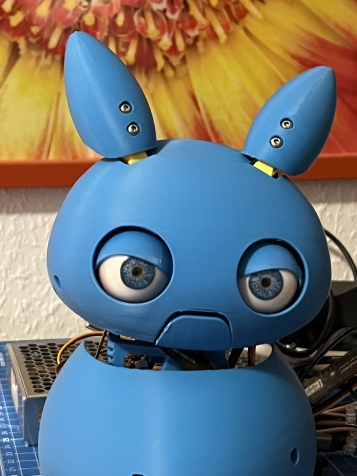
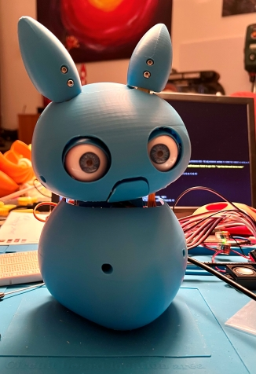
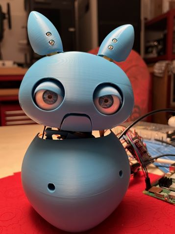

  

# Coglet VoiceAssistedLLM Robot
A robot-/animatronics-prototype with voice-I/O-interface to a local LLM running on a GPU in a client-server-architecture for natural language communication

Project-aim: **WakeWord-detection** →  **spoken input** → **Whisper (Faster-Whisper STT)** → **Ollama** → **spoken reply** (Piper-TTS) incl. **Robot eye- and head-animations, facetracking, optional status-LED** → **Followup-conversation mode**.  

## License and Credits
This project is licensed under the
[Creative Commons Attribution-NonCommercial-ShareAlike 4.0 International License](https://creativecommons.org/licenses/by-nc-sa/4.0/).

Parts of the servo control and face tracking logic are adapted from work by
[Will Cogley](https://www.willcogley.com/), used under the same license (CC BY-NC-SA 4.0).
We have modified and extended the original code for the Coglet project.

## Hardware used: 
- 1x Raspberry Pi 5 8GB with USB-C power supply
- 1x Seeedstudio Grove AI Vision V2 with camera (needs to fit into eyeball, some cameras have a too big PCB to fit), you can get this from Will Cogley's online shop: https://nmrobots.com/products/grove-vision-ai-module-v2-hd-camera-adaptor-15-pin-flex-cable
- 1x Seeedstudio ReSpeaker XMOS XVF3800 based USB 4-Mic Array (incl. 4x digital far-field mics, hardware AEC, AGC, DoA, VAD, dereverberation, beamforming, and noise suppression)
- 1x Passive speaker with 4 ohm and 3-5W, connected to speaker terminal on the ReSpeaker-module (required for hardware AEC and Barge_In to work).
- 10x MG90S micro-servo motors for robot animation
- 1x PCA9685 servo driver board (AZ Delivery/Adafruit)
- 1x Mean Well RSP-100-5, 20A 5V power supply for the servo motors
- 1x 5mm NeoPixel RGBLED with integrated 281x controller to give visual clue about the state Coglet is in (optional)
- 1x Adafruit Pixel Shifter 6066, level shifter 3.3V -> 5V for LED logic
- 3D-printed parts for Coglet from Will Cogley 
- For realistic looks you can get ultra-realistic eyeballs from Will Cogley's online shop: https://nmrobots.com/products/preorder-camera-compatible-ultra-realistic-eyes
- 1x Linux-PC for STT and LLM, equipped with Nvidia RTX GPU, 8-12 GB VRAM min., 24/32 GB (RTX4090/RTX5090) recommended

## Open-source software used (not part of this repository):
- Flask
- Faster-Whisper STT
- Ollama with model Gemma3:27b, Qwen2.5:7b-instruct or similar
- OpenWakeWord
- Mosquitto-MQTT
- Piper TTS
  
## Folder structure
- Folder `pi-side` — contains the software running on the Raspberry Pi inside the Coglet robot: Mosquitto-MQTT-server, Piper-MQTT-service, AI face detection code, servo-control code and the central Coglet-Pi-code
- Folder `server-side` — contains the software running on the Linux server with RTX GPU: Faster-Whisper with Flask and the large-v3-turbo model, Ollama with LLM Qwen-2.5:7b-instruct (or similar) customized with "Coglet"-modelfile

      
