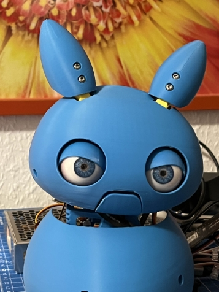
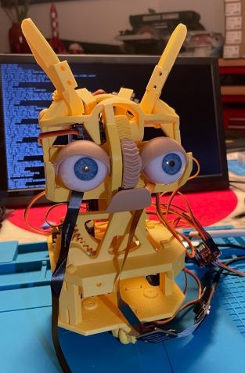
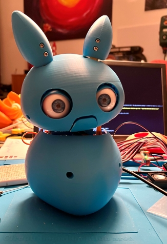
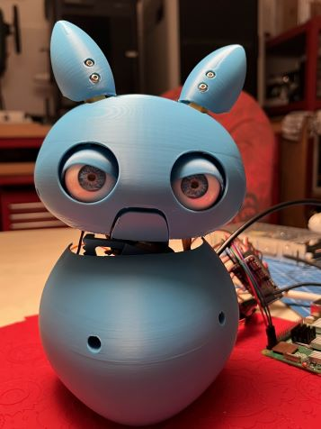

  

# Coglet VoiceAssistedLLM Robot

A robot/animatronics prototype with voice I/O, animated eyes and head movement, face tracking and two clearly separated conversation modes:

| Mode | Launcher | Conversation pipeline |
|---|---|---|
| **Local Mode** | `pi-side/coglet-local.py` | Hardware VAD or optional wakeword -> local recording -> Faster-Whisper -> Ollama -> Piper/MQTT TTS => Data protection and data privacy in mind |
| **Cloud Mode** | `pi-side/coglet-cloud.py` | Continuous OpenAI Realtime speech-to-speech session without wakeword => Data sent to OpenAI, no privacy, no protection |

The launchers are intentionally separate. `coglet-local.py` is local-only; it contains no OpenAI Realtime execution path. To use OpenAI Realtime, start `coglet-cloud.py` instead.

Both launchers use the same private `pi-side/env-exports.sh`. The selected executable determines the mode; there is no runtime backend selector.

## Local Mode

Local Mode has been designed with data privacy and data protecion in mind: It keeps the conversation fully local, nothing is sent accross the internet. 
The LLM is hosted locally, Speech-to-Text, Text-to-Speech and control logic are running locally.
By default Coglet can wake from the XVF3800 hardware VAD; OpenWakeWord remains available as an optional wakeword trigger.

```text
-> hardware VAD speech trigger or optional OpenWakeWord detection
-> spoken input
-> Faster-Whisper STT on the GPU server
-> Ollama LLM
-> Piper/MQTT TTS on the Raspberry Pi
-> spoken reply
-> follow-up conversation window
```

Robot animation, ReSpeaker audio handling, hardware VAD/DoA, face tracking, servos, status LED, deep sleep, local command detection and the local email path remain on the Raspberry Pi.

Start Local Mode with:

```bash
cd /opt/coglet-pi
source .venv/bin/activate
source env-exports.sh
python3 coglet-local.py
```

Local Mode does not require an OpenAI API key.

## OpenAI Realtime Cloud Mode

Cloud Mode is started explicitly with `coglet-cloud.py`. It opens one continuous OpenAI Realtime session immediately; there is no wakeword and no local STT/LLM/TTS pipeline for the conversation itself.

In cloud mode the LLM, VAD, Speech-to-Text und Text-to-Speech are handled by OpenAI, so your data and voice are sent over to OpenAI and no data privacy / data protection are given in Cloud mode.

The Raspberry Pi still handles:

- microphone and speaker audio,
- ReSpeaker hardware integration,
- robot animations and status LED,
- face tracking and servo control,
- graceful shutdown and servo parking,
- local SMTP email delivery.

OpenAI Realtime handles:

- server-side VAD and conversational turn detection,
- speech recognition and reasoning,
- speech generation with an OpenAI voice,
- function calling for supported Coglet tools.

Current Cloud Mode features include:

- continuous speech-to-speech conversation using `gpt-realtime-2` by default,
- configurable OpenAI voice and system prompt,
- barge-in and response cancellation,
- graceful spoken shutdown before the servos move to their park position,
- `send_email` function tool: the model creates subject and structured HTML content; the Pi sends the email through the existing local SMTP configuration,
- session usage summary on shutdown with response count, input/output tokens, cached tokens and session duration.

Start Cloud Mode with the same environment file:

```bash
cd /opt/coglet-pi
source .venv/bin/activate
source env-exports.sh
python3 coglet-cloud.py
```

### Cloud configuration

Example values in `pi-side/env-exports.sh.example`:

```bash
export OPENAI_API_KEY=""  # set only in the private env-exports.sh
export OPENAI_REALTIME_MODEL="gpt-realtime-2"
export OPENAI_REALTIME_VOICE="marin"
export OPENAI_REALTIME_REASONING_EFFORT="low"
export OPENAI_REALTIME_VAD_MODE="server_vad"
export OPENAI_REALTIME_TRANSCRIPTION="true"
export OPENAI_REALTIME_TRANSCRIPTION_MODEL="gpt-4o-mini-transcribe"
export OPENAI_REALTIME_STARTUP_MESSAGE="Ich bin online und bereit zu helfen."
export OPENAI_REALTIME_SHUTDOWN_MESSAGE="Tschüss!"
```

`coglet-cloud.py` always starts OpenAI Realtime and fails clearly when its required configuration or dependency is missing. It never falls back to Local Mode. `coglet-local.py` always starts Local Mode.

The Realtime persona/system prompt is loaded separately from the local Ollama persona. Do not commit real API keys. Cloud Mode sends conversation audio to OpenAI and incurs API usage costs.

For the complete shared environment template see `pi-side/env-exports.sh.example`. Hardware validation notes are in `pi-side/MANUAL-HARDWARE-TESTS.md`.

## License and Credits

This project is licensed under the [Creative Commons Attribution-NonCommercial-ShareAlike 4.0 International License](https://creativecommons.org/licenses/by-nc-sa/4.0/).

Parts of the servo control and face tracking logic are adapted from work by [Will Cogley](https://www.willcogley.com/), used under the same license (CC BY-NC-SA 4.0). We have modified and extended the original code for the Coglet project.

## Hardware used

- 1x Raspberry Pi 5 8GB with USB-C power supply
- 1x Seeedstudio Grove AI Vision V2 with camera
- 1x Seeedstudio ReSpeaker XMOS XVF3800 based USB 4-Mic Array with hardware AEC, AGC, DoA, VAD, dereverberation, beamforming and noise suppression
- 1x passive 4-ohm, 3-5W speaker connected to the ReSpeaker speaker terminal
- 10x MG90S micro-servo motors
- 1x PCA9685 servo driver board
- 1x Mean Well RSP-100-5, 20A 5V power supply for the servos
- 1x optional 5mm NeoPixel RGB LED
- 1x Adafruit Pixel Shifter 6066 level shifter
- 3D-printed Coglet parts from Will Cogley (https://github.com/will-cogley/Coglet/blob/main/3D%20Printing%20Files/CogletB34Parts.3mf)
- optional ultra-realistic eyeballs from Will Cogley's online shop
- 1x Linux GPU server for Local Mode; 8-12GB VRAM minimum, 24/32GB recommended

## Open-source software used

- Flask
- Faster-Whisper STT (`large-v3-turbo`)
- Ollama with customised Coglet model
- OpenWakeWord (optional Local Mode wakeword trigger)
- Mosquitto MQTT
- Piper TTS for Local Mode speech output
- OpenAI Realtime API via `websocket-client` for Cloud Mode

## Folder structure

- `pi-side/coglet-local.py` — dedicated Local Mode launcher
- `pi-side/local_mode.py` — local hardware-VAD/wakeword STT/LLM/TTS conversation implementation
- `pi-side/coglet-cloud.py` — dedicated continuous OpenAI Realtime launcher
- `pi-side/robot_runtime.py` — public shared robot-hardware facade
- `pi-side/hardware/robot_runtime.py` — servo, LED, animation and tracking runtime
- `pi-side/voice_backends/openai_realtime.py` — Realtime WebSocket/audio implementation
- `pi-side/hardware/` — Raspberry Pi hardware, servo, audio and tracking modules
- `server-side/stt_http_server.py` — Local Mode STT service
- `server-side/` — local STT, model and prompt assets

     
